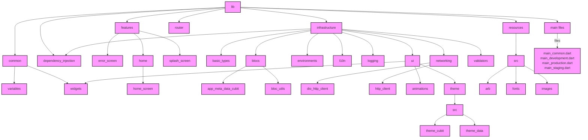

# flutter_starter_brick

A brick for bootstrapping a new Flutter project with useful features.

Includes multiple environments, API support, and Bloc for state management.

## Features

- [&check;] **Multiple Environments Configuration**: Easily set up development, staging, and production environments.
- [&check;] **API Integration**: Seamlessly integrate RESTful APIs into your project.
- [&check;] **Bloc State Management**: Manage your application's state efficiently using the Bloc pattern.
- [&check;] **Internet Connectivity Handling**: Automatically detect and handle changes in internet connectivity.
- [&check;] **Customizable UI Components**: Utilize pre-built widgets like buttons, forms, and more, ready for customization.
- [&check;] **Theming and Styling**: Implement consistent theming across your application with predefined color schemes.
- [&check;] **Internationalization (i18n)**: Support multiple languages effortlessly.
- [&check;] **Form Validation**: Built-in validation utilities to ensure data integrity in forms.
- [&check;] **Script to create APK for all platforms**.
- [&check;] **Script to upload IPA to TestFlight**.
- [&cross;] **Github actions (Coming Soon)**: Release to github releases, google play internal track, and testflight.

## Project Structure
Here is the project structure of the starter brick using mermaid.
You can view it at [https://mermaid.live/](https://mermaid.live/).

## Support Me

It is really hard and time-consuming to maintain and update open-source projects, so if you like my work and would like to support me, consider buying me a coffee, it will be a **GREAT MOTIVATION** for me to keep doing this work.

